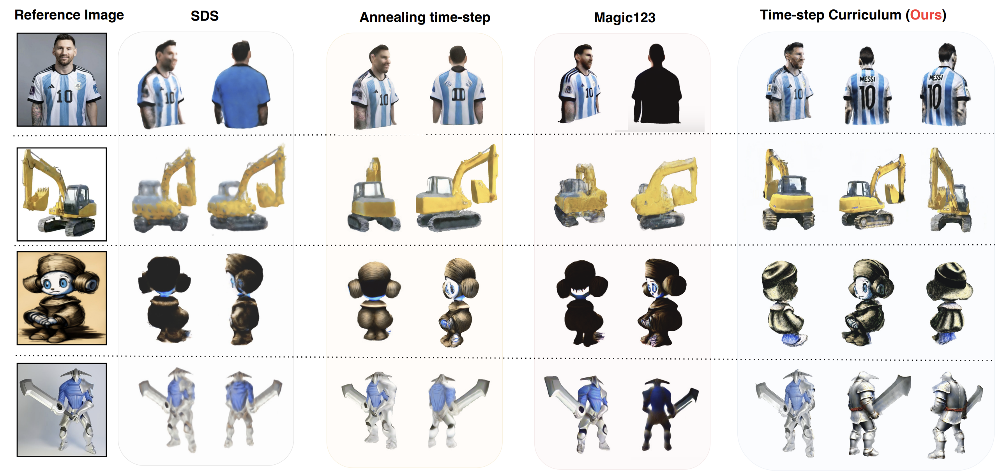

# Diffusion Time-step Curriculum for One Image to 3D Generation (CVPR 2024)

    

Acknowledgement: This repo is based on the following amazing project: [Stable-Dreamfusion](https://github.com/ashawkey/stable-dreamfusion). Thanks to my friend kiui for his excellent work!

We are still cleaning up the code and will release them around the CVPR conference. Thank you for your patience!
